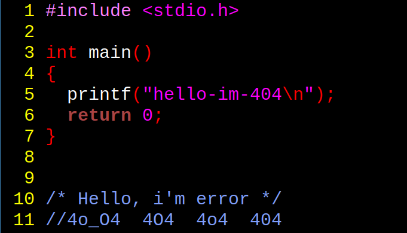

! ! ! INSTALLATION! ! !
```bash
git clone https://github.com/hello-im-404/nvim-dot.git
cd nvim-dot
./install.sh
```
! ! ! USAGE ! ! !
f2 - file tree


vim guide:
try vimtutor<br>
how to exit from vim? ESC -> :q -> Enter -> done!<br>
how to write + exit? ESC -> :wq -> Enter -> done!<br>
command mode - ESC<br>
insert mode - a/i<br>
visual mode - v<br>
copy - y(in command mode)<br>
paste - p(in command mode)<br>
undo - u(in command mode)<br>
dd - delete 1 string(u can delete many str, just type 'x'dd) x - number string which u want to delete<br>
hjkl(in command mode/visual mode)
